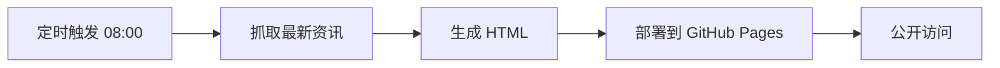

# 海外创意·AI视频·舞台设备 每日简报

一个自动化、可视化的海外社媒行业资讯聚合平台，每日定时更新。

## 功能特性

✅ **三大板块内容聚合**
- 🔥 海外社媒创意视频（TikTok、Instagram、YouTube）
- 🤖 AI视频行业新动态（技术突破、行业趋势、产品发布）
- 🎭 舞台特效设备资讯（灯光、控台、特效设备）

✅ **现代化视觉设计**
- 响应式布局，完美适配PC、手机、平板
- 卡片化设计，圆角阴影，视觉层次分明
- 流畅的hover动效，提升用户体验

✅ **自动化更新**
- 北京时间每日 08:00 自动抓取最新资讯
- GitHub Actions 驱动的无服务器部署
- 全程无需人工干预，自动生成网页

✅ **免登录访问**
- GitHub Pages 托管，公开链接直接访问
- 适合团队共享、内部展示、大屏轮播

## 快速开始

### 本地预览

```bash
# 克隆项目
git clone https://github.com/YOUR_USERNAME/daily-brief.git
cd daily-brief

# 安装依赖
pip install -r requirements.txt

# 生成最新内容
python scripts/fetch_content.py
python scripts/generate_html.py

# 本地预览
# 直接用浏览器打开 index.html
```

### 部署到 GitHub Pages

1. **Fork 或创建新仓库**
   - 登录 GitHub，创建新仓库 `daily-brief`

2. **推送代码**
   ```bash
   git init
   git add .
   git commit -m "Initial commit"
   git branch -M main
   git remote add origin https://github.com/YOUR_USERNAME/daily-brief.git
   git push -u origin main
   ```

3. **启用 GitHub Pages**
   - 进入仓库 → Settings → Pages
   - Source 选择 "Deploy from a branch"
   - Branch 选择 `gh-pages` / `main`
   - 点击 Save

4. **查看网站**
   - 等待 1-2 分钟部署完成
   - 访问 `https://YOUR_USERNAME.github.io/daily-brief`

## 自动化流程



### GitHub Actions

项目使用 GitHub Actions 实现自动化：

- **触发时间**: 北京时间每日 08:00 (`cron: '0 0 * * *'`)
- **手动触发**: 支持 Workflow dispatch
- **部署方式**: GitHub Pages

## 目录结构

```
daily-brief/
├── index.html                    # 主页面（自动生成）
├── requirements.txt              # Python 依赖
├── README.md                     # 项目说明
├── .github/
│   └── workflows/
│       └── daily-update.yml     # GitHub Actions 配置
└── scripts/
    ├── fetch_content.py         # 内容抓取脚本
    ├── generate_html.py         # HTML 生成脚本
    └── data.json                # 缓存的数据（自动生成）
```

## 自定义配置

### 修改定时任务时间

编辑 `.github/workflows/daily-update.yml`:

```yaml
schedule:
  - cron: '0 0 * * *'  # 修改为你的时间
```

### 添加更多数据源

编辑 `scripts/fetch_content.py` 添加新的RSS源或API。

### 修改样式

直接编辑 `scripts/generate_html.py` 中的 CSS 样式部分。

## 技术栈

- **前端**: HTML5 + CSS3 + Vanilla JavaScript
- **后端**: Python 3.11 + Requests + BeautifulSoup
- **自动化**: GitHub Actions
- **托管**: GitHub Pages

## 使用场景

- 📊 品牌部每日行业资讯汇总
- 🎬 海外社媒运营团队内容参考
- 🤖 AI视频行业从业者技术跟踪
- 🎭 舞台设备采购决策参考
- 📺 大屏展示/轮播显示

## 注意事项

1. 数据来源于公开RSS和网页，可能存在延迟
2. 图片使用 picsum.photos 随机图片占位，可替换为真实图片
3. 建议定期检查链接有效性
4. GitHub Pages 免费版有流量限制，大流量场景需注意

## License

MIT License - 欢迎自由使用和修改

---

**🌐 项目地址**: https://github.com/YOUR_USERNAME/daily-brief  
**📱 访问链接**: https://YOUR_USERNAME.github.io/daily-brief
